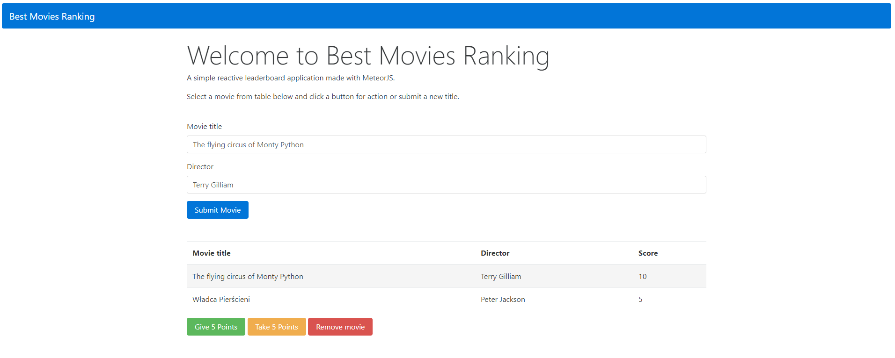

# meteor-top-songs-leaderboard
A simple reactive leaderboard application made with [MeteorJS](https://www.meteor.com).

### How to run?

1. To run the application you should have Meteor installed. First install Chocolatey, then run ```meteor npm install``` to install Meteor packages.

3. Initialize application server with ```meteor run``` command in the project directory (powershell Terminal).

4. Test the app at [localhost:3000](http://localhost:3000).

### Screens

